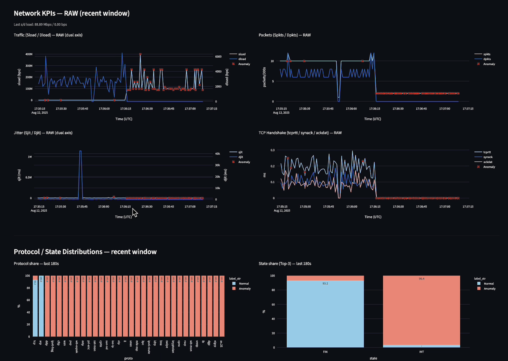
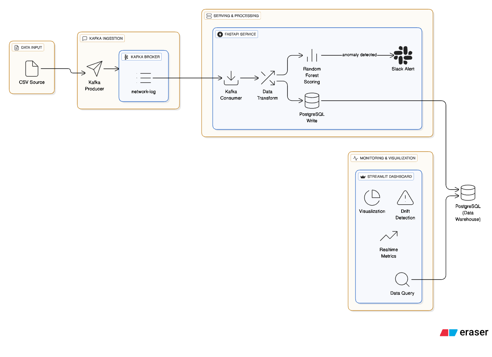
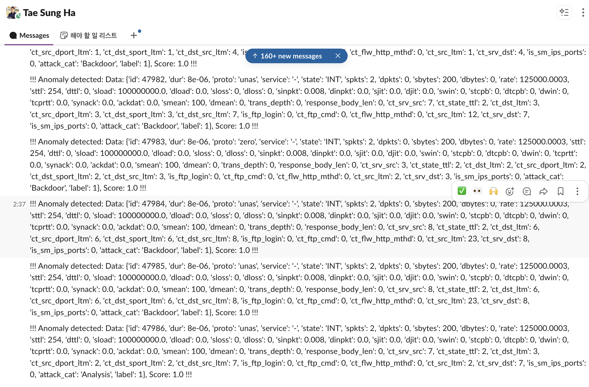

# Real-Time Network Anomaly Detection (Kafka × FastAPI × PostgreSQL × Streamlit)
 
>[60s demo: ingest → score → store → dashboard (burst alert)](https://youtu.be/XSlEOjZ624Y)

End-to-end pipeline for **real-time network anomaly detection**: ingest → infer → persist → monitor.  
It combines classic/statistical detectors (**Random Forest**, **ADWIN**, **KL/L1 divergence**) with a production-minded data stack (**Kafka**, **FastAPI**, **PostgreSQL**, **Docker Compose**) and a **Streamlit** dashboard.


---

## Project Snapshot

- **Duration**: 4 days (end-to-end implementation)
- **Model Performance** (sample dataset - UNSW-NB15):
  - ROC-AUC: 0.9939 | Precision: 95.92% | Recall: 95.93%
  - Throughput: ~1,200 events/sec | End-to-end latency: ~350ms (local test) (example)
- **Role**: Implemented all components end-to-end (data ingestion, model serving, drift detection, dashboard)  
  *Dataset preparation reused public UNSW-NB15 set*
- **Why Kafka?**: Designed for *stream-first architecture* to simulate real-time packet ingestion scenarios and practice batch→stream migration patterns, despite original dataset being CSV-based.
- **Real-world Applications**: Architecture adaptable to
  - Financial transaction fraud detection
  - IoT device monitoring & predictive maintenance
  - Security intrusion & DDoS detection

---

## Highlights

- **Streaming**: Kafka producer → FastAPI inference → PostgreSQL storage  
- **Detection**: RF for online scoring, **ADWIN** for concept drift, **KL/L1** for data drift  
- **Operations**: burst detection, thresholding, optional Slack alerts  
- **Monitoring**: fast WebGL-backed charts; filters & guardrails for large windows

---

## Architecture



---

## Tech Stack

- **Realtime**: Apache Kafka  
- **Serving**: FastAPI (Python), model artifacts (RandomForest + thresholds/encoders)  
- **Storage**: PostgreSQL (connection pool, indices)  
- **UI**: Streamlit + Plotly (WebGL)  
- **Container**: Docker Compose  
- **Drift/Anomaly**: ADWIN (concept), KL/L1 (data: proto/state/service distributions)

---

## Repository Layout

```bash
unsw-realtime-anomaly
├─ dashboard/             # Streamlit dashboard
├─ serving/               # FastAPI app (scoring, alerts)
├─ kafka/                 # Sample producer / simulator
├─ db/                    # Schema & DB utilities
├─ model/                 # Local model artifacts (ignored in git)
├─ stream/                # (optional) stream simulator
├─ etl/                   # (optional) batch utilities
├─ docker-compose.yml
└─ .env.example
```

> **Important:** Large **data/model files are not tracked in git due to their large file sizes**.  
> This project can be reviewed via the provided demo and documentation.  
> Running locally requires preparing your own dataset and trained model as described in [`model/eda&train_model.ipynb`](https://github.com/taesung-ha/unsw-realtime-anomaly/blob/main/model/eda%26train_model.ipynb).
---

## Quick Start (Docker)

### 0) Prereqs
- Docker & Docker Compose
- Create and fill `.env` from template:
```bash
cp .env.example .env
# Edit DB/SLACK vars as needed
```

### 1) Bring the stack up
```bash
docker compose up -d --build
```

### 2) Initialize DB schema (if not auto-applied)
```bash
docker compose exec db psql -U $POSTGRES_USER -d $POSTGRES_DB -f /app/db/init.sql
```

### 3) Start streaming
```bash
# Publish sample events to Kafka
python kafka/stream_producer.py
# or use stream/stream_simulator.py
```

### 4) Open the apps
- **API docs**: http://localhost:8000/docs  
- **Dashboard**: http://localhost:8501

---

## Local Development (without Docker)

```bash
python -m venv .venv && source .venv/bin/activate
pip install -r requirements.txt

cp .env.example .env
# Run API
uvicorn serving.api_server:app --reload --port 8000
# Run dashboard
streamlit run dashboard/app.py
```

---

## Environment Variables (`.env`)

```ini
# PostgreSQL
POSTGRES_HOST=localhost
POSTGRES_PORT=5432
POSTGRES_DB=anomaly
POSTGRES_USER=postgres
POSTGRES_PASSWORD=postgres

# Kafka
KAFKA_BROKERS=localhost:9092
KAFKA_TOPIC=network-log

# Alerts (optional)
SLACK_WEBHOOK_URL=https://hooks.slack.com/services/...
```

`db/db_config.py` reads these and builds `DB_CONFIG`.

---

## Data & Model

- **Model**: RandomForest produces a probability-like **score**; thresholding yields a **label** (0/1).  
- **Concept drift (ADWIN)**: monitors streaming metrics (e.g., score time-series) to detect regime shifts.  
- **Data drift (KL/L1)**: compares categorical distributions (e.g., `proto`, `state`, `service`) across windows.  
- **Burst detection**: if ≥ *N* anomalies within the last *W* minutes → raise alert.

---

## Database

- **Table**: `public.anomaly_scores`
- **Columns** (typical):  
  `stime TIMESTAMPTZ, source TEXT, score FLOAT, label INT, proto TEXT, state TEXT, service TEXT, sload/dload FLOAT, spkts/dpkts INT, sjit/djit FLOAT, sttl/dttl INT, dur FLOAT, tcprtt FLOAT, synack FLOAT, ackdat FLOAT, ct_state_ttl INT ...`

---

## API

This service operates solely as a streaming pipeline:
Kafka → FastAPI (consumer) → Slack / PostgreSQL DB.

---

## Dashboard (Streamlit)

- **Controls**: time window, auto-refresh interval, score threshold, burst window & min hits  
- **Filters**: `proto`, `service`, `state`; row cap; EMA smoothing  
- **Views**:
  - **Anomaly score timeline** with threshold & hit markers  
  - **RAW KPIs**: sload/dload (dual axis), spkts/dpkts, jitter, TCP handshake (tcprtt/synack/ackdat)  
  - **Distributions**: protocol/state percent stacks (Normal vs Anomaly, Top-K + “Other”)  
  - **Heatmap**: `ct_state_ttl` grouped buckets over time  
  - **Recent anomalies & Top-10** tables with **CSV download**  

Built-in optimizations: caching (`@st.cache_resource`, `@st.cache_data`), connection pooling, WebGL rendering.

---

## Demo

- **Full video (YouTube)**: https://youtu.be/XSlEOjZ624Y  

<details>
  <summary>GIF preview (click to expand)</summary>

  

</details>

---

## Alerts & Notifications

- **Trigger**: score ≥ `threshold`.  
- **Channel**: Slack webhook (optional, set `SLACK_WEBHOOK_URL` in `.env`).

**Example Slack message:**



Payload snippet:
```json
{
  "id": 47986,
  "dur": 8e-06,
  "proto": "unas",
  "service": "-",
  "state": "INT",
  "spkts": 2,
  "dpkts": 0,
  "sbytes": 200,
  "dbytes": 0,
  "rate": 125000.0003,
  "sttl": 254,
  "dttl": 0,
  "sload": 100000000.0,
  "dload": 0,
  "sloss": 0,
  "dloss": 0,
  "sinpkt": 0.008,
  "dinpkt": 0.0,
  "sjit": 0.0,
  "djit": 0.0,
  "stcpb": 0,
  "dtcpb": 0,
  "dwin": 0,
  "tcprtt": 0.0,
  "synack": 0.0,
  "ackdat": 0.0,
  "smean": 100,
  "dmean": 0,
  "trans_depth": 0,
  "response_body_len": 0,
  "ct_srv_src": 7,
  "ct_state_ttl": 2,
  "ct_dst_ltm": 3,
  "ct_src_dport_ltm": 2,
  "ct_dst_sport_ltm": 2,
  "ct_dst_src_ltm": 7,
  "is_ftp_login": 0,
  "ct_ftp_cmd": 0,
  "ct_flw_http_mthd": 0,
  "ct_src_ltm": 2,
  "ct_srv_dst": 7,
  "is_sm_ips_ports": 0,
  "attack_cat": "Analysis",
  "label": 1
}
```

---

## Handy Commands

```bash
# Clear notebook outputs (before commit)
jupyter nbconvert --clear-output --inplace **/*.ipynb

# Lint/format (if configured)
ruff check . && ruff format .

# Compose up
docker compose up -d --build
```

---

## Roadmap

- [ ] `/metrics` (Prometheus) endpoint  
- [ ] Stronger input validation (pydantic models)  
- [ ] Table partitioning & TTL/archiving job  
- [ ] CI: lint + tests + Docker build (GitHub Actions)  

---

## License & Data

- Code license: **Tae Sung Ha**
- Datasets (e.g., UNSW-NB15) follow their original licenses; this repo **does not** include large data files.

---

## Contributing

Issues and PRs are welcome. Please include reproducible steps (env, inputs, expected results).
